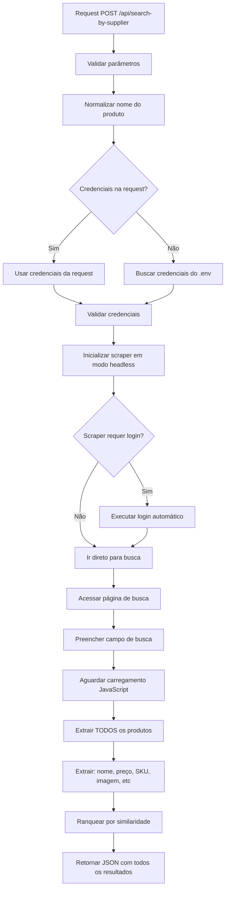

# 🔍 API de Busca por Fornecedor - Documentação

## Visão Geral

Endpoint específico para buscar produtos pelo nome em um fornecedor específico, retornando **TODOS** os resultados encontrados com o máximo de informações disponíveis.

## Endpoint

```
POST /api/search-by-supplier
```

## Características

✅ **Modo Headless**: Scraping executado sem abrir janela/GUI
✅ **Login Automático**: Usa credenciais do CRUD ou variáveis de ambiente
✅ **Todos os Resultados**: Retorna todos os produtos encontrados (sem limite)
✅ **Informações Completas**: Nome, preço, SKU, imagem, disponibilidade, link
✅ **Segurança**: Credenciais nunca aparecem em logs ou respostas
✅ **JavaScript Dinâmico**: Aguarda carregamento completo da página

---

## Request

### Estrutura JSON

```json
{
  "product_name": "Cimento Portland CP-II 50kg",
  "supplier_id": "sup_12345",
  "supplier_name": "Estoque Megaleste",
  "username": "opcional_usuario",
  "password": "opcional_senha"
}
```

### Parâmetros

| Campo | Tipo | Obrigatório | Descrição |
|-------|------|-------------|-----------|
| `product_name` | string | ✅ Sim | Nome do produto a buscar (min 2 caracteres) |
| `supplier_id` | string | ✅ Sim | ID do fornecedor no sistema |
| `supplier_name` | string | ✅ Sim | Nome do fornecedor (ver lista abaixo) |
| `username` | string | ❌ Não | Usuário para login (opcional, busca do .env se não fornecido) |
| `password` | string | ❌ Não | Senha para login (opcional, busca do .env se não fornecido) |

### Fornecedores Disponíveis

- `Estoque Megaleste` ou `megaleste`
- `Cofema Materiais` ou `cofema`
- `Estoque Atacadista` ou `estoque_atacadista`

---

## Response

### Estrutura JSON

```json
{
  "product_name": "Cimento Portland CP-II 50kg",
  "supplier_id": "sup_12345",
  "supplier_name": "Estoque Megaleste",
  "total_results": 15,
  "results": [
    {
      "store": "Estoque Megaleste",
      "product_name": "Cimento Portland CP-II E-32 50kg",
      "price": 32.90,
      "currency": "BRL",
      "product_url": "https://www.megaleste.com.br/produto/cimento-portland-cp-ii-e-32-50kg",
      "add_to_cart_url": "https://www.megaleste.com.br/produto/cimento-portland-cp-ii-e-32-50kg",
      "availability": "em_estoque",
      "score": 0.95,
      "sku": "CIM-CP2-50",
      "image_url": "https://www.megaleste.com.br/images/produtos/cimento.jpg",
      "description": null,
      "brand": null,
      "timestamp": "2026-03-17T10:30:45.123456"
    },
    {
      "store": "Estoque Megaleste",
      "product_name": "Cimento Portland CP-II F-32 50kg",
      "price": 31.50,
      "currency": "BRL",
      "product_url": "https://www.megaleste.com.br/produto/cimento-portland-cp-ii-f-32-50kg",
      "add_to_cart_url": "https://www.megaleste.com.br/produto/cimento-portland-cp-ii-f-32-50kg",
      "availability": "em_estoque",
      "score": 0.92,
      "sku": "CIM-CP2F-50",
      "image_url": "https://www.megaleste.com.br/images/produtos/cimento-f.jpg",
      "description": null,
      "brand": null,
      "timestamp": "2026-03-17T10:30:45.789012"
    }
  ],
  "generated_at": "2026-03-17T10:30:50.123456"
}
```

### Campos da Response

| Campo | Tipo | Descrição |
|-------|------|-----------|
| `product_name` | string | Nome do produto buscado (original) |
| `supplier_id` | string | ID do fornecedor |
| `supplier_name` | string | Nome do fornecedor |
| `total_results` | integer | Total de produtos encontrados |
| `results` | array | Lista de todos os produtos encontrados |
| `generated_at` | string | Timestamp ISO 8601 da geração da resposta |

### Campos de cada Produto (results)

| Campo | Tipo | Descrição |
|-------|------|-----------|
| `store` | string | Nome da loja |
| `product_name` | string | Nome do produto encontrado |
| `price` | float | Preço do produto |
| `currency` | string | Moeda (padrão: BRL) |
| `product_url` | string | URL do produto |
| `add_to_cart_url` | string | URL para adicionar ao carrinho |
| `availability` | string | Disponibilidade: `em_estoque`, `por_encomenda`, `indisponivel` |
| `score` | float | Score de similaridade com a busca (0-1) |
| `sku` | string \| null | Código/SKU do produto (se disponível) |
| `image_url` | string \| null | URL da imagem do produto (se disponível) |
| `description` | string \| null | Descrição adicional (se disponível) |
| `brand` | string \| null | Marca do produto (se disponível) |
| `timestamp` | string | Timestamp ISO 8601 da extração |

---

## Exemplos de Uso

### Exemplo 1: Busca Básica (sem credenciais na request)

```bash
curl -X POST "http://localhost:8000/api/search-by-supplier" \
  -H "Content-Type: application/json" \
  -d '{
    "product_name": "Tijolo Cerâmico",
    "supplier_id": "sup_001",
    "supplier_name": "Cofema Materiais"
  }'
```

> **Nota**: Credenciais serão buscadas automaticamente das variáveis de ambiente.

### Exemplo 2: Busca com Credenciais Explícitas

```bash
curl -X POST "http://localhost:8000/api/search-by-supplier" \
  -H "Content-Type: application/json" \
  -d '{
    "product_name": "Argamassa AC3",
    "supplier_id": "sup_002",
    "supplier_name": "Estoque Megaleste",
    "username": "meu_usuario",
    "password": "minha_senha"
  }'
```

### Exemplo 3: Usando Python

```python
import requests

url = "http://localhost:8000/api/search-by-supplier"
payload = {
    "product_name": "Cimento Portland",
    "supplier_id": "sup_123",
    "supplier_name": "Estoque Megaleste"
}

response = requests.post(url, json=payload)
data = response.json()

print(f"Encontrados {data['total_results']} produtos:")
for produto in data['results']:
    print(f"- {produto['product_name']}: R$ {produto['price']:.2f}")
    print(f"  URL: {produto['product_url']}")
    if produto['sku']:
        print(f"  SKU: {produto['sku']}")
```

### Exemplo 4: Usando JavaScript/TypeScript

```typescript
const response = await fetch('http://localhost:8000/api/search-by-supplier', {
  method: 'POST',
  headers: {
    'Content-Type': 'application/json',
  },
  body: JSON.stringify({
    product_name: 'Telha Colonial',
    supplier_id: 'sup_456',
    supplier_name: 'Cofema Materiais'
  })
});

const data = await response.json();

console.log(`Total de resultados: ${data.total_results}`);
data.results.forEach(product => {
  console.log(`${product.product_name} - R$ ${product.price}`);
});
```

---

## Configuração de Credenciais

### Opção 1: Variáveis de Ambiente (.env)

```env
# Estoque Megaleste
SUPPLIER_ESTOQUE_MEGALESTE_USERNAME=seu_usuario
SUPPLIER_ESTOQUE_MEGALESTE_PASSWORD=sua_senha

# Cofema Materiais
SUPPLIER_COFEMA_MATERIAIS_USERNAME=seu_usuario
SUPPLIER_COFEMA_MATERIAIS_PASSWORD=sua_senha

# Estoque Atacadista
SUPPLIER_ESTOQUE_ATACADISTA_USERNAME=seu_usuario
SUPPLIER_ESTOQUE_ATACADISTA_PASSWORD=sua_senha
```

### Opção 2: Request Direta

Passar `username` e `password` diretamente no JSON da request (útil quando credenciais vêm do CRUD).

### Opção 3: Integração com CRUD (Futuro)

O serviço `CredentialsManager` pode ser estendido para buscar credenciais de um banco de dados usando o `supplier_id`.

---

## Códigos de Status HTTP

| Código | Descrição |
|--------|-----------|
| `200` | Sucesso - Produtos encontrados |
| `400` | Bad Request - Parâmetros inválidos |
| `404` | Not Found - Fornecedor não possui scraper implementado |
| `500` | Internal Server Error - Erro no servidor/scraping |

---

## Erros Comuns

### 400 - Nome do produto muito curto

```json
{
  "detail": "Nome do produto deve ter pelo menos 2 caracteres"
}
```

### 400 - Credenciais inválidas

```json
{
  "detail": "Credenciais inválidas (usuário ou senha muito curtos)"
}
```

### 404 - Fornecedor não implementado

```json
{
  "detail": "Fornecedor 'Loja XYZ' não possui scraper implementado. Fornecedores disponíveis: Estoque Megaleste, megaleste, Cofema Materiais, cofema, Estoque Atacadista, estoque_atacadista"
}
```

### 500 - Erro no scraping

```json
{
  "detail": "Erro ao processar busca: [mensagem de erro]"
}
```

---

## Fluxo de Execução



---

## Segurança

### ✅ Boas Práticas Implementadas

1. **Credenciais nunca em logs**: Senhas são mascaradas em todos os logs
2. **Credenciais nunca na response**: JSON de resposta nunca contém senhas
3. **Validação de entrada**: Todos os parâmetros são validados
4. **Suporte a criptografia**: Sistema preparado para criptografar senhas no banco
5. **Headless mode**: Scraping invisível, sem GUI

### 🔐 Recomendações

- Use variáveis de ambiente para credenciais em produção
- Configure `CREDENTIALS_ENCRYPTION_KEY` para criptografar senhas
- Não envie credenciais em URLs (sempre use POST body)
- Implemente rate limiting para evitar abuso
- Use HTTPS em produção

---

## Performance

- **Timeout padrão**: 15 segundos por scraping
- **Modo paralelo**: Múltiplas buscas podem rodar simultaneamente
- **Cache**: Não implementado (scraping sempre busca dados atualizados)
- **Limite de resultados**: Sem limite - retorna todos os produtos encontrados

---

## Testar no Swagger UI

1. Acesse: http://localhost:8000/docs
2. Encontre `POST /api/search-by-supplier`
3. Clique em "Try it out"
4. Preencha o JSON de exemplo
5. Clique em "Execute"

---

## Troubleshooting

### Problema: "Nenhum produto encontrado"

**Soluções:**
- Verifique se o nome do produto está correto
- Tente um termo de busca mais genérico
- Verifique os logs do servidor para erros de scraping

### Problema: "Login falhou"

**Soluções:**
- Verifique credenciais no `.env`
- Teste login manual no site do fornecedor
- Verifique se seletores CSS do scraper estão atualizados

### Problema: "Timeout ao buscar"

**Soluções:**
- Aumente `SCRAPING_TIMEOUT` no `.env`
- Verifique conexão com internet
- Verifique se site do fornecedor está no ar

---

## Próximos Passos

1. ✅ Endpoint implementado
2. ⏳ Integrar com banco de dados para buscar credenciais
3. ⏳ Adicionar mais fornecedores
4. ⏳ Implementar cache de resultados
5. ⏳ Adicionar paginação de resultados
6. ⏳ Implementar webhook para notificar quando scraping terminar

---

**Dúvidas?** Consulte a documentação principal em `backend/README.md`
